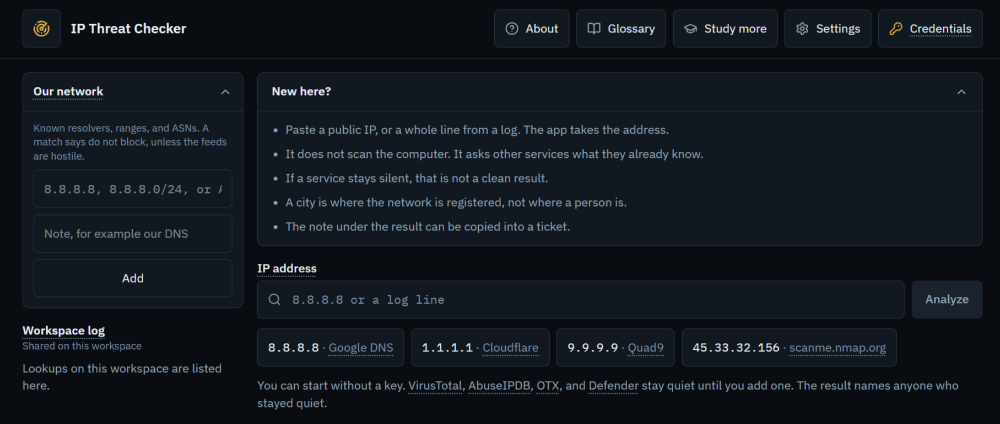
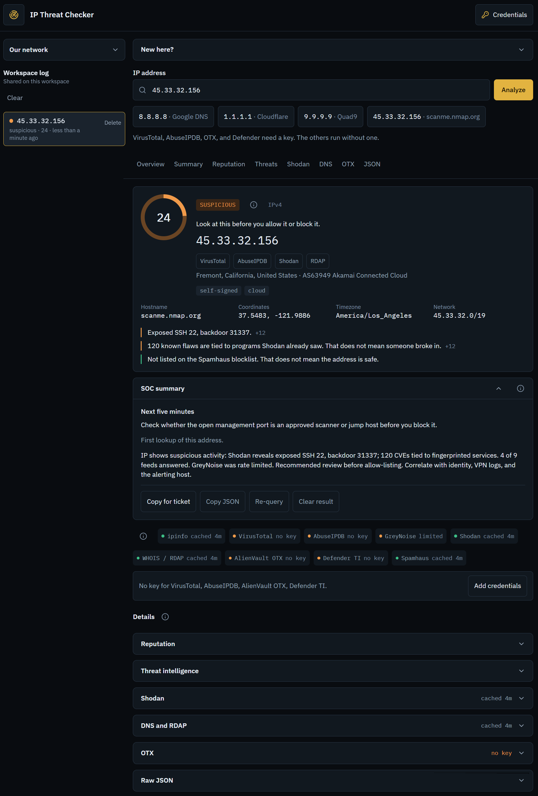

# IP Threat Checker

Created with Grok

A first look at one public IP. The page asks services that already know the address, then writes a verdict, a score, and a short note for a ticket. It does not scan the host.

Unknown is not clean. A source that stayed quiet is not a promise. The number on the page is this page's score, not a score from those services.





Licensed under MIT. See [LICENSE](LICENSE).

## Start the page

Download the project from GitHub (Code, then Download ZIP) and unzip it. You want the folder that contains `package.json`. The same folder contains `docker-compose.yml`. If you see only one folder after unzipping, open that folder.

There are two ways to start it. Use one.

### Node.js

You need Node.js 22. Open PowerShell and run:

```powershell
node --version
```

The number must start with `v22`. If PowerShell says `node` is not recognized, install Node.js 22, close PowerShell, and open it again.

Open PowerShell in the project folder. In File Explorer, click the address bar, type `powershell`, and press Enter. The blue window should show the path of that folder.

Install the pieces the page needs. On Windows, `npm.cmd` is the command that PowerShell will run. `npm` alone can be blocked.

```powershell
npm.cmd install
```

A long list of names will scroll by. That is normal, not an error. Wait until you can type again. You do this once, and again only after you download a newer copy.

Start the page:

```powershell
npm.cmd run dev
```

Wait until a line like this appears:

```text
Local: http://localhost:8080
```

Then open [http://localhost:8080](http://localhost:8080) in a browser. If that line is not there yet, the browser has nothing to open.

Leave the PowerShell window open while you use the page. Press `Ctrl+C` in that window to stop it. Closing the window stops it too.

### Docker

Docker runs the same page. If you use it, you do not need Node.js.

Install Docker Desktop and wait until it says it is running. The whale icon in the taskbar should be still, not animated.

Open PowerShell in the project folder. In File Explorer, click the address bar, type `powershell`, and press Enter.

Start the page:

```powershell
docker compose up
```

The first time, a long list will scroll by while Docker downloads and builds. That is normal, not an error. It can take several minutes. Wait until a line like this appears:

```text
Local: http://localhost:8080
```

Then open [http://localhost:8080](http://localhost:8080) in a browser.

Leave the PowerShell window open while you use the page. Press `Ctrl+C` in that window to stop it. If the page is still open afterward, run `docker compose down`.

Either way, you can look up an address with no key. VirusTotal, AbuseIPDB, OTX, and Defender stay quiet until you add one. The page names anyone who stayed quiet.

## Use it

Paste a public IPv4 or IPv6 address, or one line from a log, and press **Analyze**. A port after the address, as in `8.8.8.8:53`, is dropped. A private address such as `192.168.1.1` is refused.

The example buttons only fill the box. They do not start a lookup.

The first line says who answered and what that does not prove. **Copy for ticket** copies the note under that line. **Clear result** clears the page, not the log.

Keys go in **Credentials**, in the header. They stay in that browser. They are not written into the log. Do not put them in a file in this folder.

The log on the left lasts only while the page is running. When you stop the terminal, it is gone. Do not open this page to the internet. Anyone who can open it sees the same log.

**About** says where the page stops. **Glossary** explains the words. **Study more** lists other sites for the basics.

## Which sources answer without a key

| Source | Without a key |
|---|---|
| ipinfo | Place, ASN, and a basic record. VPN, proxy, Tor, and hosting flags need a token. |
| VirusTotal | No. |
| AbuseIPDB | No. |
| GreyNoise | A thin answer for IPv4. A key adds the fuller record. |
| Shodan | Ports, names, and known flaws from an older record. A key adds banners and a honeypot score. |
| WHOIS / RDAP | Yes. Registration and the abuse contact. |
| AlienVault OTX | No. |
| Defender Threat Intelligence | No. |
| Spamhaus ZEN | Yes. Not listed does not mean the address is safe. |
